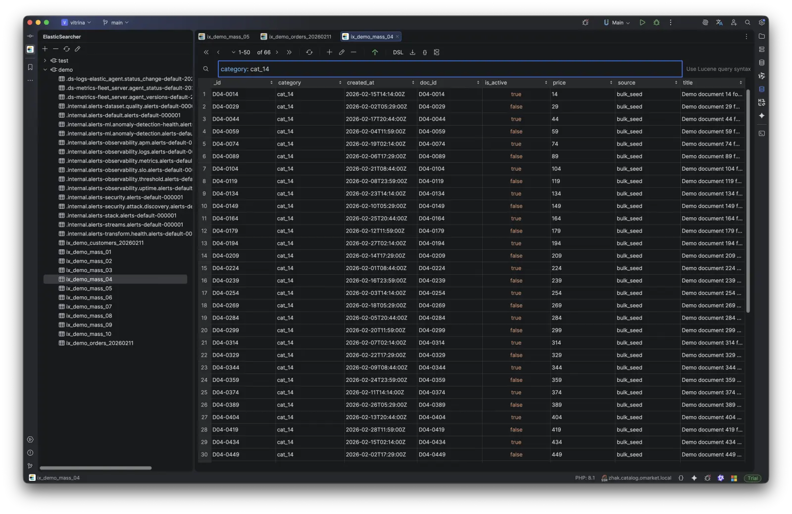
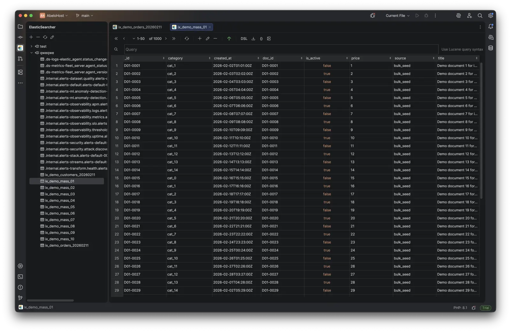

# Elasticsearcher

Elasticsearcher is an IntelliJ-based plugin for working with Elasticsearch directly from your IDE.

## Documentation and Website

Full documentation and product site: [https://elasticsearcher.netlify.app/](https://elasticsearcher.netlify.app/)

## Key Features

- Connect to one or multiple Elasticsearch clusters
- Run and iterate queries without leaving IDE
- Inspect responses and debug search behavior faster
- Keep Elasticsearch workflows inside developer context

## Screenshots

### Dark Theme

### Light Theme

## Installation

- Install from JetBrains Marketplace (link can be added here)
- Or follow setup instructions from the docs site above

## Support

- Documentation: [https://elasticsearcher.netlify.app/](https://elasticsearcher.netlify.app/)
- Issues: open a GitHub Issue in this repository

## License

See [EULA.md](EULA.md) for plugin usage terms.
